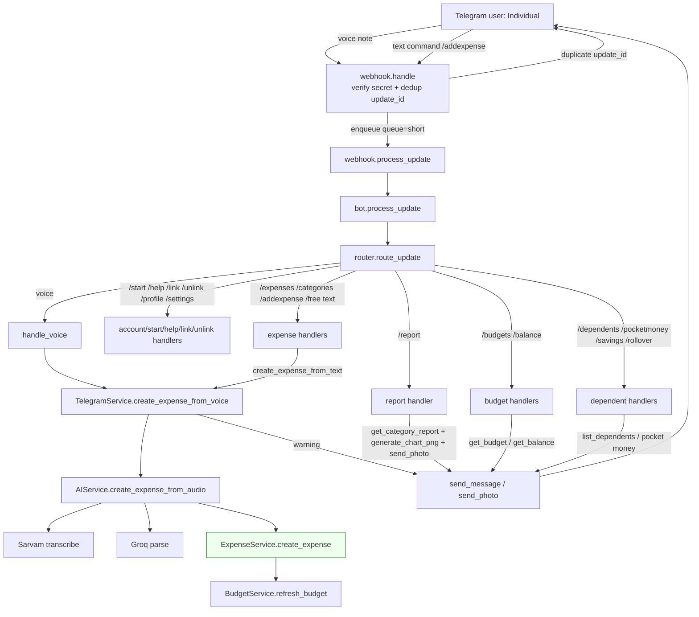
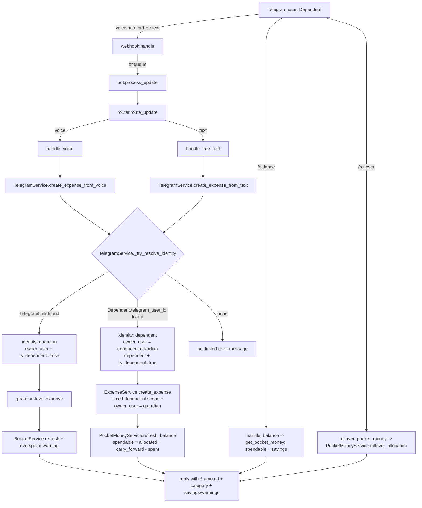

# Expense Manager — Codebase Audit Report

**App:** `expense_manager` (Frappe v16)
**Repo root:** `/home/korecent/frappe/my-bench/apps/expense_manager` (git repo; the bench root is not)
**Live site:** `expense.local` (developer mode); test site: `expense-test.localhost`
**Method:** read-only static audit. No files were modified, no migrations/DB writes performed, no tests executed against the live site. All line references are to files under the repo root. Findings that can only be confirmed by a live run are marked **[needs live run]**.

---

## Table of Contents

1. [App & Site Overview](#1-app--site-overview)
2. [DocType Inventory](#2-doctype-inventory)
3. [Service Layer](#3-service-layer)
4. [Telegram Bot Layer](#4-telegram-bot-layer)
5. [Scheduled Jobs](#5-scheduled-jobs)
6. [Desk Reports & Dashboard](#6-desk-reports--dashboard)
7. [AI Pipeline](#7-ai-pipeline)
8. [Test Suite](#8-test-suite)
9. [End-to-End Flowcharts](#9-end-to-end-flowcharts)
10. [Open Issues & Discrepancies](#10-open-issues--discrepancies)

---

## 1. App & Site Overview

### 1.1 Identity & stack

| Aspect | Value | Source |
|---|---|---|
| App name | `expense_manager` | `pyproject.toml:2` |
| Author | Sanket Kumar | `pyproject.toml:3-5` |
| Description | "Expense Tracker" | `pyproject.toml:6` |
| Python | `>=3.14` | `pyproject.toml:7` |
| Dependencies | `matplotlib>=3.7`, `openai>=1.0`, `requests>=2.28` | `pyproject.toml:10-15` |
| Framework | Frappe v16 (installed/managed by bench) | `pyproject.toml:11` |
| Lint | ruff, line-length 110, tab indent | `pyproject.toml:29-67` |

Product concept (README.md:1-35): personal/family expense tracking fronted by a Telegram bot; a voice note like *"I spent 200 on Zomato"* is transcribed (Sarvam AI), parsed (Groq LLM), and written to an Expense record.

### 1.2 Repository layout

```
apps/expense_manager/
├── expense_manager/                      # app root (Python package)
│   ├── hooks.py                          # Frappe hooks (269 lines)
│   ├── install.py                        # after_install seeding (8 lines)
│   ├── api/                              # 7 whitelisted REST modules + utils
│   ├── telegram/                         # webhook, bot, router, handlers, services, utils
│   ├── services/                         # 9 domain services + exceptions
│   ├── ai/                               # Sarvam adapter, Groq parser, exceptions
│   ├── jobs/                             # 4 live jobs + 2 empty modules
│   ├── constants/                        # enums + default categories
│   ├── config/                           # ConfigurationError
│   ├── utils/                            # logger only (helpers.py is empty)
│   ├── tests/                            # 16 test modules + base.py
│   └── expense_manager/                  # nested module dir
│       ├── doctype/                      # 7 DocTypes
│       ├── report/                       # 10 Script Reports
│       └── setup/                        # dashboard.py (workspace/charts/cards)
├── docs/                                 # 18 markdown docs (2,017 lines)
├── PROJECT_ANALYSIS.md                   # phase-1 deliverable (164 lines)
├── telegram_architecture.md              # phase-2 deliverable (462 lines)
├── AGENTS.md, pyproject.toml, README.md, license.txt
```

Note the two-level package structure: the app package is `expense_manager/`, and DocTypes/Reports live in the nested `expense_manager/expense_manager/` module (a non-standard convention that matters for every `after_migrate`/report import path).

### 1.3 Git state

5 commits (newest first): `824196c` "Feat: Added voice and AI features Working Fine", `1a7dda3` "Fix: Complete Expense Manager core features with errors fixed", `d37254b` "Fix: close assignment gaps, add overspend notifications, report charts, and pocket money rollover", `d25313e` "Initial Commit :Check before Ai services", `0e2973a` "feat: Initialize App".

Working tree is **dirty: 65 uncommitted entries** (42 modified, 15 deleted, 8 untracked):

- Modified (42): `docs/roadmap.md`; `ai/ai_parser.py`, `ai/exceptions.py`; `api/budgets.py`, `api/categories.py`, `api/expenses.py`, `api/utils.py`; `constants/ai.py`, `constants/default_categories.py`; `doctype/budget/{budget.json,budget.py}`, `doctype/category/{category.json,category.py}`, `doctype/dependent/dependent.json`, `doctype/expense/{expense.json,expense.py}`, `doctype/pocket_money_allocation/pocket_money_allocation.py`; `hooks.py`; `jobs/budget_alerts.py`; `services/{ai_service,budget_service,category_service,expense_service,pocket_money_service,report_service}.py`; `telegram/handlers/{budget,dependent,expense,help,voice}.py`; `telegram/router.py`; `telegram/services/telegram_service.py`; `tests/base.py` + 11 `test_*.py` files.
- Deleted (15): all of the old `expense_manager/report/` path — `budget_utilization`, `category_breakdown`, `dependent_expenses`, `monthly_expense_summary`, `pocket_money_history` (3 files each).
- Untracked (8): `expense_manager/doctype/ai_settings/`, `expense_manager/doctype/dependent/hooks.py`, `expense_manager/doctype/user/`, `expense_manager/report/` (new path, 10 reports), `expense_manager/setup/`, `install.py`, `jobs/pending_allocation_reminders.py`, `tests/test_budget_handler.py`.

Interpretation: an in-progress phase that (a) moved the 5 original reports to the nested module dir and added 5 more (10 total), (b) added the AI Settings DocType, user/dependent seeding hooks, install script, workspace setup, and pending-allocation reminders job, and (c) rewrote much of the service layer and tests.

### 1.4 Site configuration

`/home/korecent/frappe/my-bench/sites/expense.local/site_config.json` contains live secrets (lines 9-18): `groq_api_key`, `groq_model`, `openai_api_key`, `sarvam_api_key`, `telegram_bot_token`, `telegram_webhook_secret`, plus `developer_mode: 1`. Keys are never hardcoded in code — all reads go through `telegram/config.py` (env var first, then `frappe.conf`, see §4.1) and `docs/environment.md`. **Risk:** whether `site_config.json` is git-ignored could not be verified from inside the app repo; see issue #10.

### 1.5 Frappe wiring (`expense_manager/hooks.py`)

| Hook | Target | Line |
|---|---|---|
| `after_migrate` | `expense_manager.expense_manager.setup.dashboard.after_migrate` | hooks.py:90 |
| `after_install` | `expense_manager.install.after_install` | hooks.py:91 |
| `doc_events.Dependent.after_insert` | `...doctype.dependent.hooks.dependent_after_insert` | hooks.py:143-146 |
| `doc_events.User.on_update` | `...doctype.user.hooks.user_on_update` | hooks.py:147-150 |
| `scheduler_events.daily` | 4 job entries | hooks.py:172-179 |
| `doctype_js` | `{"User": "public/js/user.js"}` | hooks.py:47 |

Install lifecycle:
- `install.py:5-8` — `after_install()` seeds default categories for `Administrator`.
- `setup/dashboard.py:10-14` — `after_migrate()` creates dashboard charts, number cards and a workspace (see §6.2).
- `doctype/dependent/hooks.py:7-9` — new Dependent → `CategoryService.create_default_categories(guardian, dependent=...)`.
- `doctype/user/hooks.py:11-20` — User with role **"Expense Manager User"** (`GUARDIAN_ROLE`, user/hooks.py:8) → default categories seeded (idempotent).

### 1.6 Constants inventory

- `constants/expense.py` — `ExpenseSource` (Telegram/Web/API/Manual), `PaymentMethod` (7 values).
- `constants/budget.py` — `BudgetPeriod` (Weekly/Monthly/Quarterly/Yearly).
- `constants/dependent.py` — `Relationship` (Son/Daughter/Brother/Sister/Spouse/Parent/Friend/Other).
- `constants/pocket_money.py` — `AllocationPeriod` (Weekly/Monthly/Quarterly/Yearly).
- `constants/ai.py` — `SpeechToTextConfig`, `ExpenseParsingConfig` (see §7).
- `constants/default_categories.py:1-15` — **13** default categories with icons; `CATEGORY_ALIASES` (lines 17-95) maps ~80 brand/generic words to categories.
- **Empty files:** `constants/telegram.py` (0 bytes), `constants/statuses.py` (0 bytes), `constants/__init__.py`, `utils/__init__.py`, `utils/helpers.py` (11-line placeholder; real helpers live in `telegram/utils/`).
- `config/exceptions.py` — `ConfigurationError`; `config/__init__.py` is a single comment line.
- `utils/logger.py` — module-level `logger = frappe.logger("expense_manager", allow_site=True, file_count=10)`.

---

## 2. DocType Inventory

Seven DocTypes. **Permissions are System Manager-only for six of them; only `Expense` also grants the "Expense Manager User" role** (see issue #20).

| DocType | Fields (fieldname) | Controller | Permissions |
|---|---|---|---|
| Expense | owner_user, expense_date, category, amount, description, source, payment_method, voice_transcript, dependent | expense.py | System Manager + Expense Manager User (R/W/C, no delete) |
| Category | category_name, icon, owner_user, dependent, is_active | category.py | System Manager |
| Budget | owner_user, category, dependent, period, start_date, end_date, is_active, notes, allocated_amount, spent_amount, alert_threshold_pct, last_alert_sent_on | budget.py | System Manager |
| Dependent | dependent_name, guardian, relationship, telegram_username, allow_carry_forward, telegram_user_id, is_active, total_savings, pending_allocation_since, last_allocation_reminder_on, default_monthly_allowance | dependent.py | System Manager |
| Pocket Money Allocation | dependent, allocated_amount, allocation_date, allocation_period, carry_forward_amount, total_available_amount, remarks, is_active | pocket_money_allocation.py | System Manager |
| Telegram Link | user, first_name, last_name, is_active, telegram_user_id, telegram_username, language_code, linked_on | telegram_link.py | System Manager |
| AI Settings (Single) | groq_api_key (Data), api_secret_keygroq (Password) | ai_settings.py (`pass`) | System Manager |

### 2.1 Expense
- `before_insert` sets `owner_user = frappe.session.user` when empty (expense.py:15-17).
- Validation (expense.py:19-32): amount `> 0`; `expense_date` cannot be in the future; description ≤ 500 chars; voice_transcript ≤ 10,000 chars.
- Source/payment_method are NOT enforced at the DocType level — the service layer validates against the enums (`ExpenseService._validate_source`, expense_service.py:335).

### 2.2 Category
- Validation (category.py:13-21): name required; duplicate check is **case-insensitive** and scoped to `owner_user` + `dependent` scope (category.py:28-49); icon ≤ 50 chars.
- The `dependent` field makes categories dual-scoped: a `null` dependent means "guardian-level", a value means "dependent-scoped" (matters throughout the service layer).

### 2.3 Budget
- Validation (budget.py:16-25): allocated_amount `> 0`; spent_amount `>= 0`; `alert_threshold_pct` must be in **1..100**; start ≤ end; no overlapping active budget for the same owner/category/period/scope (budget.py:61-90).
- Derived currency fields (`spent_amount`, `last_alert_sent_on`) are written by the service layer (`BudgetService.refresh_budget` / `try_claim_budget_alert`), not by the controller.

### 2.4 Dependent
- Validation (dependent.py:15-22): dependent_name/guardian/relationship/default_monthly_allowance required; allowance `>= 0`; duplicate name per guardian rejected (dependent.py:40-52); telegram_username no spaces, ≤ 32 chars; telegram_user_id digits only.
- Savings ledger fields: `total_savings`, `pending_allocation_since`, `last_allocation_reminder_on`, `allow_carry_forward` — the first three are written by the rollover/reminder machinery (§5).
- DocType-level hook seeds dependent-scoped categories on insert (dependent/hooks.py:7-9).

### 2.5 Pocket Money Allocation
- Validation (pocket_money_allocation.py:14-21): dependent/allocated_amount/allocation_date/allocation_period required; **zero amount is legal** — explicitly commented as a rolled-over, not-yet-topped-up period (pocket_money_allocation.py:39-44); `total_available_amount` is derived (`allocated + carry_forward`, lines 51-57); allocation_date not in future; no duplicate active allocation for same dependent/period/date (lines 71-87).

### 2.6 Telegram Link
- One link per Frappe user **and** one link per Telegram user — enforced in the controller (telegram_link.py:59-96), with mirror checks in `TelegramLinkService`.
- Validation (telegram_link.py:18-26): user/telegram_user_id/linked_on required; telegram_user_id digits; username rules; language_code ≤ 10 chars.

### 2.7 AI Settings
- `pass` controller, and **nothing reads this DocType** — runtime AI config comes from site_config/env via `telegram/config.py` (§4.1). The DocType's `groq_api_key` field is therefore dead UI (issue #12).

---

## 3. Service Layer

Nine services in `services/` plus `exceptions.py` (196 lines). Design rules per `docs/architecture.md` / `docs/coding_guidelines.md`: business logic lives here; handlers/API are thin; all DB access uses `ignore_permissions=True` because operations are system-triggered.

### 3.1 Exception hierarchy (`services/exceptions.py`)

`ExpenseManagerError` base → `ValidationError`, `CategoryError` (4 subtypes), `BudgetError` (6 subtypes), `ExpenseError` (5 subtypes), `DependentError` (4 subtypes), `PocketMoneyError` (8 subtypes), `TelegramError` (6 subtypes), `ReportError` (1 subtype), `TelegramServiceError` → `UnauthorizedTelegramActionError`. AI errors are separate: `ai/exceptions.py` defines `AIError` → `SpeechTranscriptionError`, `ExpenseParsingError`, `LowConfidencePredictionError`, `IncomeDetectedError`. Every error message is user-friendly by convention (`docs/error_handling.md`).

### 3.2 Services and their public methods (file:line)

**ExpenseService** — expense_service.py:27
- `create_expense` (:30), `get_expense` (:76), `update_expense` (:83), `delete_expense` (:139), `list_expenses` (:162), `get_recent_expenses` (:207, limit 10), `get_expenses_by_category` (:219), `get_expenses_by_date_range` (:231).
- Private validators: `_create_doc` (:245), `_get_expense` (:257, ownership-scoped), `_validate_category` (:277), `_validate_dependent` (:285), `_validate_amount` (:293), `_validate_expense_date` (:314), `_validate_source` (:335).
- All list/get/update/delete paths scope by `owner_user` and return NotFound for cross-owner access (no existence leak).

**CategoryService** — category_service.py:22
- `create_category` (:26), `get_category` (:75), `category_exists` (:90), `update_category` (:161), `archive_category` (:217), `restore_category` (:233), `list_categories` (:249, supports `include_all` + dependent scope), `search_categories` (:290), `delete_category` (:329), `create_default_categories` (:355, idempotent seed of the 13 defaults), private helpers `_normalize_name` (:153), `_set_active_status` (:386), `_validate_delete` (:418).

**BudgetService** — budget_service.py:28
- `create_budget` (:31), `get_budget` (:87), `update_budget` (:95), `delete_budget` (:144), `archive_budget` (:160), `restore_budget` (:168), `list_budgets` (:176), `search_budgets` (:220), `get_budget_usage` (:257), `refresh_budget` (:291), `list_all_active_budgets` (:534, **system-level only** — docstring forbids handler/API use), `build_budget_alert_message` (:547), `can_send_budget_alert` (:555), `mark_budget_alert_sent` (:564), `try_claim_budget_alert` (:570, atomic once-a-day claim).
- Key logic: `_get_active_budget_for_category` (:361) prefers a dependent-scoped budget when a dependent is present, else the guardian "family" budget (`dependent is not set`, :376). `_calculate_spent_amount` (:390) uses **raw SQL `SUM`** (see issue #21) — guardian-level budgets count expenses across the whole household including dependents (:404-414).
- `refresh_budget` recomputes `spent_amount` from the Expense table and calls `_check_overspend` (:419) which logs but does not throw.

**DependentService** — dependent_service.py:24
- `create_dependent` (:27), `get_dependent` (:75), `dependent_exists` (:82), `update_dependent` (:99), `archive_dependent` (:153), `restore_dependent` (:160), `list_dependents` (:167), `search_dependents` (:195), `get_active_dependent_by_telegram_id` (:224), `delete_dependent` (:244), `_validate_relationship` (:316), `_validate_allowance` (:325).

**PocketMoneyService** — pocket_money_service.py:28
- `create_allocation` (:35), `get_allocation` (:93), `update_allocation` (:100), `delete_allocation` (:143), `archive_allocation` (:160), `restore_allocation` (:167), `list_allocations` (:174), `search_allocations` (:209), `get_balance` (:242), `refresh_balance` (:292), `build_low_balance_messages` (:348, "low" = remaining < 20% of allocated), `list_dependents_pending_allocation` (:378, system-level), `_clear_pending_allocation_on_dependent` (:396), `try_claim_pending_allocation_reminder` (:404), `get_period_end_date` (:488, weekly +6d, monthly/quarterly/yearly −1d), `rollover_allocation` (:600).
- **Rollover semantics** (:600-651): deactivates the current allocation; if `remaining > 0` and `allow_carry_forward`, the remainder is **added to `Dependent.total_savings`** (the Phase-24 "savings ledger"); sets `pending_allocation_since`; creates a zero-amount next-period allocation with remark "Rolled over from previous period".

**ReportService** — report_service.py:17 (read-only by philosophy, docstring :18-28)
- `get_expense_summary` (:35), `get_budget_summary` (:55), `get_pocket_money_summary` (:97), `get_category_breakdown` (:125), `get_monthly_report` (:161), `get_dependent_report` (:183), `get_spending_trend` (:204), `get_dashboard_summary` (:233), `get_expense_detail_report` (:241), `get_pocket_money_detail_report` (:311), `get_guardian_overview_data` (:362), `get_category_analytics_data` (:408), `get_monthly_expense_trend_data` (:465), `build_no_expenses_today_message` (:504), plus weekly/monthly summary builders used by the reminders job.

**TelegramLinkService** — telegram_link_service.py:40
- `link_account` (:55, generates the token), `verify_and_link` (:94), `unlink_account` (:170), `get_link` (:198), `get_user_by_telegram` (:202), `is_linked` (:224), `list_links` (:233), `search_links` (:257), `refresh_link` (:297).
- **Token design:** `LINK_TOKEN_EXPIRY_MINUTES = 10` (line 27); tokens are **hashed and stored in the Frappe cache** (`_CACHE_PREFIX` line 36, `_CACHE_TTL_BUFFER_MINUTES = 5` line 37) rather than in a DB table, because the Telegram Link DocType cannot exist before `telegram_user_id` is known. The DocType comment/summary in the module top explains this rationale.

**AIService** — ai_service.py:18 (see §7.3)
- `_raise_if_income` (:37) with `INCOME_KEYWORDS` (lines 20-23), `create_expense_from_audio` (:64), `create_expense_from_text` (:115), `_resolve_category` (:159), `_derive_dependent` (:204), `_load_known_categories` (:42, auto-seeds defaults).

**services/__init__.py** — defines `initialize_services()` (:4) which is **never called anywhere** in the codebase (dead API, issue #16).

---

## 4. Telegram Bot Layer

Flow: `webhook.handle` → enqueue → `webhook.process_update` → `bot.process_update` → `router.route_update` → handler → `TelegramService` → domain service → reply via `send_message`.

### 4.1 Configuration (`telegram/config.py`, 94 lines)

All getters are `@lru_cache(maxsize=1)` and read env var first, then `frappe.conf.get`:

| Getter | Env / site-config key | Line |
|---|---|---|
| `get_telegram_bot_token()` | `TELEGRAM_BOT_TOKEN` / `telegram_bot_token` | config.py:38 |
| `get_telegram_webhook_secret()` | `TELEGRAM_WEBHOOK_SECRET` / `telegram_webhook_secret` | config.py:44 |
| `get_sarvam_api_key()` | `SARVAM_API_KEY` / `sarvam_api_key` | config.py:49 |
| `get_groq_api_key()` | `GROQ_API_KEY` / `groq_api_key` | config.py:55 |
| `get_groq_model()` | `GROQ_MODEL` / `groq_model` (default `llama-3.3-70b-versatile`, :16) | config.py:61 |
| `get_use_mock_ai_apis()` | `USE_MOCK_AI_APIS` / `use_mock_ai_apis` (bool/0/1/string) | config.py:75 |

Missing required value → `ConfigurationError` (from `config/exceptions.py`) raised **without echoing the value**.

### 4.2 Webhook ingress (`telegram/webhook.py`, 125 lines)

`@frappe.whitelist(allow_guest=True, methods=["POST"]) handle()` (webhook.py:16-58):

1. Verify `X-Telegram-Bot-Api-Secret-Token` header via `hmac.compare_digest` against configured secret (:21, `_verify_secret_token` :68-73). `ConfigurationError` → 503 (:22-24); bad secret → re-raised `PermissionError` (Telegram sees 403, :25-27).
2. Parse + validate payload; malformed JSON / non-dict / missing numeric `update_id` → **`{"ok": True}`** so Telegram never retries junk (:29-37).
3. **Deduplication:** `_claim_update` (:90-94) does an atomic Redis `SET NX` with 24 h TTL on a site-scoped key `{site}:expense_manager:telegram_update:{update_id}` (:104-106). Duplicate → `{"ok": True}` (:39-41).
4. Enqueue `method="expense_manager.telegram.webhook.process_update"`, `queue="short"` (:43-48). On enqueue failure: release the claim, log, and raise `ServiceUnavailableError` (:50-55).
5. `process_update` (:61-65) is a lazy-importing delegator to `bot.process_update` (avoids a circular import).
6. Structured logging of update_id/type/status/latency via `_log_webhook_event` (:109-118) — never logs payloads or secrets.

### 4.3 Bot dispatcher (`telegram/bot.py`, 34 lines)

`process_update` (bot.py:9-24): calls `route_update`; if a text reply is returned, extracts `chat.id` (`_get_chat_id`, :27-34) and sends via `send_message`; logs but never re-raises (safe reply boundary). `send_message` returns `None` for photo-only replies (e.g. `/report`).

### 4.4 Router (`telegram/router.py`, 127 lines)

- `COMMAND_HANDLERS` (:32-49) maps **16 commands** to handlers: `start, help, link, unlink, profile, settings, expenses, addexpense, categories, budgets, balance, report, dependents, pocketmoney, savings, rollover`.
- `route_update` (:52-107): non-message updates ignored; **voice messages dispatched before text** (:63-71); command extracted with optional `@botname` suffix stripped and lowercased (`_extract_command`, :119-127); non-command text → `handle_free_text`; unknown command → `handle_unknown`; any exception → generic "Sorry, something went wrong" (:103-107).

### 4.5 Handlers (`telegram/handlers/`, 13 files)

| File | Handler(s) | Behavior |
|---|---|---|
| start.py | `handle_start` | Welcome, personalised if already linked (start.py:7-26) |
| help.py | `handle_help` | **Static list of 15 commands — omits `/settings`** (help.py:4-29; issue #4) |
| link.py | `handle_link` | Rejects when already linked; requires `/link <code>`; calls `complete_link` with from-user profile fields (link.py:7-38) |
| unlink.py | `handle_unlink` | Requires `/unlink confirm` (unlink.py:7-20) |
| account.py | `handle_profile`, `handle_settings` | Profile: role + account; **settings is a stub** returning "not available yet" (account.py:21-22; issue #17) |
| expense.py | `handle_expenses`, `handle_categories`, `handle_addexpense`, `handle_free_text` | Free text is parsed as an expense via AI (expense.py:57-68); `/addexpense <text>` same via AI (expense.py:38-54) |
| budget.py | `handle_budgets`, `handle_balance` | Budget list with icon + over-budget marker (budget.py); balance routes dependents to pocket money |
| dependent.py | `handle_dependents`, `handle_pocketmoney`, `handle_savings`, `handle_rollover` | Pocket-money/savings display; rollover calls `TelegramService.rollover_pocket_money` |
| report.py | `handle_report` | Top-10 category breakdown → `generate_chart_png` → `send_photo` (report.py:8-37) |
| voice.py | `handle_voice` | Downloads voice file to temp, calls `create_expense_from_voice`, deletes temp in `finally` (voice.py:12-36) |
| unknown.py | `handle_unknown` | Fallback text |

All handlers follow the same shape: extract `telegram_user_id` → call exactly one `TelegramService` method → format/return text. No handler touches the DB or AI directly.

### 4.6 TelegramService orchestration (`telegram/services/telegram_service.py`, 769 lines)

Module-level: `send_message` (:37-69, exponential backoff `TELEGRAM_RETRY_BACKOFF_BASE * 2**attempt`, ≤ `TELEGRAM_MAX_RETRIES` = 2) and `send_photo` (:72-106). Constants in `telegram/utils/constants.py`: API/file base URLs, timeouts (send 10 s / photo 15 s / getFile 10 s / download 30 s), retries 2, backoff base 1.0.

Class `TelegramService` (all `@staticmethod`):

- **Expense ops:** `create_expense` (:118), `update_expense` (:156), `delete_expense` (:184), `list_expenses` (:200), `build_expenses_display` (:235, groups guardian + dependents), `create_expense_from_voice` (:338), `create_expense_from_text` (:377). Voice/text creation appends an overspend warning and returns "Logged ₹X under <icon> <Category>".
- **Reports:** `get_dashboard` (:418), `get_budget` (:431), `get_monthly_report` (:444), `get_category_report` (:460), `get_dependent_report` (:473).
- **Dependents/pocket money:** `list_dependents` (:498), `get_pocket_money` (:511), `rollover_pocket_money` (:719, guardian-only flow but dependents can invoke it themselves).
- **Categories:** `list_categories` (:537, dedupes category names for guardians).
- **Account:** `get_link_status` (:572), `unlink_account` (:589), `complete_link` (:745), `get_help` (:606 — lists **16 commands including `/settings`**, inconsistent with `handlers/help.py`, issue #4).
- **Identity resolution** (the security core): `_try_resolve_identity` (:648) tries `TelegramLinkService.get_user_by_telegram` → guardian identity; else `DependentService.get_active_dependent_by_telegram_id` → dependent identity (owner = `dependent["guardian"]`); else `None`. `_resolve_identity` (:675) raises `TelegramNotLinkedError`; `_require_guardian` (:686) raises `UnauthorizedTelegramActionError` for dependents; `_resolve_guardian_or_error` (:632) gates guardian-only actions. Every public method returns `{"success": False, "message": <friendly>}` on domain errors — no raw exceptions reach Telegram.

### 4.7 Utilities

- `telegram/utils/helpers.py` — `get_telegram_user_id` (:10-21, tolerant str-cast), `get_chat_id` (:23-29), plus a TODO stub `normalize_update_payload`.
- `telegram/utils/file_download.py` — `download_voice_file` (:18-51): `getFile` → validate `ok`/`result.file_path` → download → `NamedTemporaryFile(suffix=".ogg"|remote ext, delete=False)`.
- `telegram/middleware/` — `auth.py`, `logging.py`, `__init__.py` are **pass-only TODO placeholders and are not wired anywhere** (issue #15).

---

## 5. Scheduled Jobs

Four live jobs registered under `scheduler_events["daily"]` (hooks.py:172-179); two empty modules.

| Job | Entry point | Registered (hooks.py) | Purpose |
|---|---|---|---|
| Monthly rollover | `jobs/monthly_rollover.py:11` | :174 | Period-end pocket-money rollover |
| Budget alerts | `jobs/budget_alerts.py:18` | :175 | Daily overspend/threshold Telegram alerts |
| Reminders | `jobs/reminders.py:13` | :176 | No-expenses / weekly / monthly / low-balance nudges |
| Pending allocation reminders | `jobs/pending_allocation_reminders.py:12` | :177 | Nudge guardian to assign next period's pocket money |
| (empty) | `jobs/monthly_budget_reset.py` | — | 0 lines |
| (empty) | `jobs/reports.py` | — | 0 lines (README lists a "report generation" job; not implemented) |

All jobs follow one pattern: enumerate system-wide rows, delegate business rules to a service, `frappe.db.commit()` per success and `frappe.db.rollback()` per failure, and log `notified/skipped/failed` totals.

- **Budget alerts** (budget_alerts.py:18-83): for every active budget, `refresh_budget` → `get_budget_usage`; notify when `is_overspent or pct_used >= alert_threshold_pct` (:43); once-per-day dedup via `try_claim_budget_alert` (:49-55); `_notify` (:86-119) routes to the **guardian's** Telegram chat (dependents have no Telegram Link — documented design note :90-94), prefixes `[Dependent Name]` for dependent budgets, and falls back to an unscoped category fetch when a dependent-scoped category lookup fails (:101-108).
- **Reminders** (reminders.py:13-96): `_collect_reminders` (:68-96) assembles no-expenses-today + weekly + monthly summaries from `ReportService` and low-balance messages from `PocketMoneyService.build_low_balance_messages`; sends each message with a commit.
- **Monthly rollover** (monthly_rollover.py:11-81): despite the name, runs **daily** against all active allocations regardless of period (documented rationale :12-27); rolls over when `today > period_end` computed via `PocketMoneyService.get_period_end_date` (:41-48); skips allocations whose dependent has no guardian.
- **Pending allocation reminders** (pending_allocation_reminders.py:12-73): for each dependent with `pending_allocation_since`: skip if guardian unlinked (:33-37); **clears the stale flag** if an allocation with `allocated_amount > 0` already exists (:39-44); once-per-day dedup (:46-49); message includes rolled-over savings.

---

## 6. Desk Reports & Dashboard

### 6.1 The ten Script Reports (`expense_manager/expense_manager/report/`)

All are thin `execute(filters=None)` wrappers scoped to `frappe.session.user` (`owner_user`), delegating to `ReportService`. **All ten JSON files grant only the System Manager role** (verified via the JSON `permissions` blocks) — combined with §2 permissions, non-System-Manager desk users effectively see no app data (issue #20/#23).

| Report | `execute` line | Delegates to | Filters |
|---|---|---|---|
| budget_utilization | budget_utilization.py:10 | `ReportService.get_budget_summary` (:15) | category |
| category_analytics | category_analytics.py:10 | `get_category_analytics_data` (:24) + pie chart | month, year, individual |
| category_breakdown | category_breakdown.py:10 | `get_category_breakdown` (:17) | dependent, date_from, date_to |
| dependent_expenses | dependent_expenses.py:19 | `get_dependent_report` (:27) | dependent |
| expense_summary | expense_summary.py:10 | `get_expense_detail_report` (:20) + chart (:63) | from_date, to_date, individual, dependent, category |
| guardian_overview | guardian_overview.py:10 | `get_guardian_overview_data` (:23) | month, year |
| monthly_expense_summary | monthly_expense_summary.py:10 | `get_monthly_report` (:15) | year |
| monthly_expense_trend | monthly_expense_trend.py:10 | `get_monthly_expense_trend_data` (:20) + chart (:55) | year, individual |
| pocket_money_history | pocket_money_history.py:10 | `get_pocket_money_summary` (:12) | year |
| pocket_money_summary | pocket_money_summary.py:10 | `get_pocket_money_detail_report` (:23) | month, year, dependent |

Git status shows these 10 as untracked at the nested path while the original 5 were deleted from `expense_manager/report/` — the reports were relocated during the in-progress phase (§1.3).

### 6.2 Dashboard setup (`setup/dashboard.py`, 286 lines)

`after_migrate` (dashboard.py:10-14) idempotently creates:

- **5 Dashboard Charts** (:17-59): Expense Trend (Line / Monthly Expense Trend), Category Spending (Pie / Category Analytics), Pocket Money Utilization (Bar / Pocket Money Summary), Savings Growth (Line / **Monthly Expense Trend** — reuses the expense-trend report, a naming smell, issue #25), Budget Utilization (Bar / Expense Summary).
- **8 Number Cards** (:73-154): Total Expenses, Monthly Expenses, Total Savings (sum `carry_forward_amount`), Remaining Pocket Money (sum `total_available_amount`), Total Dependents (count), Overspent Categories (sum `spent_amount`), Monthly Budget (sum `allocated_amount`), Budget Remaining.
- **Workspace "Expense Manager"** (:166-286): default workspace with 4 chart links, 4 number cards, 5 report links (Expense Summary, Pocket Money Summary, Guardian Overview, Category Analytics, Monthly Expense Trend) and 4 shortcuts (New Expense / New Pocket Money Allocation / New Category / New Dependent).

### 6.3 Report REST endpoints (`api/reports.py`)

`generate_chart_png` (:26-46) is a matplotlib helper (bar chart → PNG bytes, not whitelisted — imported directly by `handlers/report.py`). Whitelisted read-only wrappers: `get_expense_summary` (:55), `get_budget_summary` (:69), `get_pocket_money_summary` (:78), `get_category_breakdown` (:87), `get_monthly_report` (:101), `get_dependent_report` (:114), `get_spending_trend` (:123), `get_dashboard_summary` (:132) — all scoped to the session user.

### 6.4 Remaining API surface

`api/expenses.py` (create/get/update/delete/list/recent/by_category/by_date_range), `api/budgets.py` (8 CRUD + `get_budget_usage`), `api/categories.py` (8 CRUD + `create_default_categories`), `api/dependents.py` (8 CRUD), `api/pocket_money.py` (8 CRUD + `get_balance` + `rollover_allocation`), `api/telegram.py` (`generate_link_code` :13, `get_link_status` :26, `unlink` :41). All use `current_user()` (`api/utils.py:12`) and `resolve_category_id` (:20) — note docs/api.md references a `_resolve_category_id` that doesn't exist (issue #8).

---

## 7. AI Pipeline

Flow: `TelegramService.create_expense_from_voice` → `AIService.create_expense_from_audio` → `speech_to_text.transcribe` → `ai_parser.parse_expense` → `ExpenseService.create_expense`.

### 7.1 Speech-to-text — Sarvam (`ai/speech_to_text.py`, 82 lines)

- Config (`constants/ai.py:3-8`): endpoint `https://api.sarvam.ai/speech-to-text`, model `saaras:v3`, mode `transcribe`, default language `unknown`, timeout 30 s, retries 2.
- POST with backoff `2 ** attempt` (speech_to_text.py:78-80); 4xx → `SpeechTranscriptionError` with body snippet (:43-53); empty transcript → error (:59-60); network errors retried, then raised after retries.
- Mock mode (`use_mock_ai_apis`) returns a canned transcript **"I spent 200 on Zomato"** for deterministic tests; tests never hit the live API.

### 7.2 Parser — Groq (`ai/ai_parser.py`, 207 lines)

- `parse_expense` (:27-69) calls Groq in JSON mode (`llama-3.3-70b-versatile` by default) and retries once on parse failure.
- System prompt (:72-97): exactly five keys, brand→category hints (Zomato→Food Delivery, Netflix→Entertainment, etc.), "today" anchoring.
- `_validate_expense_json` (:166-206): required keys (`constants/ai.py:13` — amount, category, description, date, transaction_type); amount numeric `> 0`; category resolved via `_resolve_category_name` (:125-163: exact CI match → `CATEGORY_ALIASES` → difflib closest match ≥ 0.45 → "Uncategorized"); **future dates clamped to today** (:192-193), dates > 30 days in the past rejected (:194-197), missing date → today.
- Income signal (`transaction_type == "income"`) is surfaced but rejected upstream (see below).

### 7.3 Orchestration (`services/ai_service.py`, 212 lines)

- `create_expense_from_audio` (:64): transcribe → `_raise_if_income` → load/seed categories → parse → reject `transaction_type != "expense"` (:84-85) → resolve category → derive dependent → `ExpenseService.create_expense` with `voice_transcript`.
- `create_expense_from_text` (:115): same minus transcription.
- `_raise_if_income` (:37) — two-layer income detection (keyword/regex pre-check on the raw text + the parser's `transaction_type`).
- `_load_known_categories` (:42-61): seeds the 13 defaults when the user/scope has none, then returns live category rows (guardians get `include_all=True`).
- `_resolve_category` (:159-201): canonical → closest-match → create "Uncategorized" fallback.
- `_derive_dependent` (:204-212): a dependent-scoped category resolves the dependent even when none was supplied.
- `IncomeDetectedError` (ai/exceptions.py:17) is raised for income messages; `INCOME_MSG` is defined in `ai_service.py`.

### 7.4 Error philosophy

`docs/error_handling.md` mandates: friendly message mapping for every known failure, retry table (Sarvam 2× exponential; Groq 1× fixed 2 s; never retry 4xx), logging via `frappe.logger("expense_manager")`, and never logging keys/audio/full transcripts. The code implements this consistently (e.g. voice.py:31-33 generic fallback, webhook.py structured logs).

---

## 8. Test Suite

### 8.1 Inventory — 422 test functions across 16 modules (`expense_manager/tests/`)

| Module | Tests |
|---|---|
| test_expense_service.py | 86 |
| test_ai_service.py | 58 |
| test_pocket_money_service.py | 36 |
| test_category_service.py | 36 |
| test_report_service.py | 33 |
| test_telegram_link_service.py | 32 |
| test_integration.py | 31 |
| test_budget_service.py | 30 |
| test_dependent_service.py | 24 |
| test_reminders.py | 16 |
| test_telegram_service.py | 11 |
| test_webhook.py | 9 |
| test_budget_handler.py | 7 |
| test_router.py | 6 |
| test_telegram_config.py | 5 |
| test_webhook_management.py | 2 |
| **Total** | **422** |

Plus 7 pass-only DocType test stubs (22 lines each: `test_expense.py`, `test_ai_settings.py`, `test_budget.py`, `test_category.py`, `test_pocket_money_allocation.py`, `test_telegram_link.py`, `test_dependent.py`).

### 8.2 Test architecture

- `tests/base.py` (232 lines) provides `ServiceTestCase` with a patched `frappe` module (`get_doc`, `get_all`, `db.exists`, `db.get_value`, `throw`, `commit`, `rollback`, `logger`), a `self.mock_doc`, a `_make_doc(base, **overrides)` factory, and `frappe.utils.today` pinned to `"2026-07-27"` for determinism. Sample fixtures: `SAMPLE_USER = "guardian@example.com"`, `SAMPLE_CATEGORY`, `SAMPLE_DEPENDENT`, `SAMPLE_EXPENSE` (expense_date `"2026-07-15"`).
- AI modules are tested against **mocked HTTP responses / mocks** — never the live Sarvam/Groq APIs (per `docs/testing_strategy.md`).
- `test_budget_handler.py` (untracked, 111 lines) is the newest addition — handler-level tests for `handle_budgets`/`handle_balance` icon rendering using a fixed Telegram user id fixture.
- `test_integration.py` covers cross-service workflows: voice→AI→expense→budget refresh, linking lifecycle, pocket-money rollover, budget alert detection.

### 8.3 How to run

```bash
bench --site expense.local run-tests --app expense_manager        # on the live site
bench --site expense-test.localhost run-tests --app expense_manager  # recommended isolated run
```

Not executed during this audit (read-only scope). Run on `expense-test.localhost`, not `expense.local`. **[needs live run]**

### 8.4 Documentation drift on counts

`docs/testing.md:39`, `docs/deployment.md:95`, and `README.md:138/145` claim **290 tests**; `docs/roadmap.md` records "269 unit tests" and "290 total"; the per-file counts in `docs/testing.md:22-36` are stale (e.g. `test_ai_service` 30→58). Actual: **422** (issue #1/#2).

---

## 9. End-to-End Flowcharts

### 9.1 Individual (Guardian) flow — voice expense, budgets, reports



### 9.2 Dependent flow — identity resolution through `Dependent.telegram_user_id`



Key security property (both flows): a Dependent's Telegram id only resolves within its own `guardian` scope; every service lookup re-verifies ownership, and guardian-only actions (`/unlink`, `/report` at guardian level) go through `_resolve_guardian_or_error` → `_require_guardian` (telegram_service.py:632-691).

---

## 10. Open Issues & Discrepancies

### Documentation drift

1. **Test counts are stale everywhere.** Docs claim 290 tests / 269 unit (`docs/testing.md:39`, `docs/deployment.md:95`, `docs/roadmap.md`, `README.md:138,145`); actual suite is **422** across 16 modules (§8.1).
2. **Per-file counts stale** in `docs/testing.md:22-36`; `test_budget_handler.py` (7) is missing from the layout entirely.
3. **README contradictions:** "six DocTypes" (`README.md:143`) and "15 commands" (`README.md:144`) — actual 7 DocTypes and 16 router commands (`telegram/router.py:32-49`).
4. **`/help` command count mismatch:** `handlers/help.py:4-29` lists 15 commands (omits `/settings`); `telegram/router.py` registers it, and `TelegramService.get_help` (telegram_service.py:606-618) includes it.
5. **Default category list drift:** `docs/doctypes.md` documents a 7-item seed list; `constants/default_categories.py:1-15` defines **13** defaults.
6. **LLM JSON schema drift:** `docs/prompts.md` describes keys `merchant/notes/confidence/date`; the parser actually requires `amount, category, description, date, transaction_type` (`constants/ai.py:13`, `ai/ai_parser.py:178-206`).
7. **OTP expiry drift:** `docs/environment.md` says `otp_expiry_minutes` default 5; actual `TelegramLinkService.LINK_TOKEN_EXPIRY_MINUTES = 10` (telegram_link_service.py:27).
8. **API doc drift:** `docs/api.md` references `_resolve_category_id`; the actual helper is `resolve_category_id` (`api/utils.py:20`).
9. **Exception tree drift:** `docs/error_handling.md` lists `SpeechToTextError` and omits `IncomeDetectedError`/`LowConfidencePredictionError`; actual `ai/exceptions.py` defines `SpeechTranscriptionError` (not `SpeechToTextError`), `LowConfidencePredictionError`, and `IncomeDetectedError`.

### Security & configuration

10. **Live secrets in `site_config.json` (lines 9-18):** six real API keys/tokens for `expense.local`. Whether the bench's gitignore excludes `sites/*/site_config.json` could not be verified from the app repo; if this bench is ever pushed/shared, keys leak. Also `developer_mode: 1` in what looks like a shared repo. **[verify: gitignore at bench root]**
11. **Dead AI config:** `openai_api_key` is set in site_config and `openai>=1.0` is a dependency, but all LLM calls use the **`groq`** client (`ai/ai_parser.py`). Either the OpenAI key/dependency or the parser's provider is stale.
12. **AI Settings DocType is dead UI:** its `groq_api_key` (Data) and `api_secret_keygroq` (Password) fields are never read; runtime config comes exclusively from env/site_config via `telegram/config.py`. A user entering a key there would get silent no-op behavior.

### Dead / incomplete code

13. **Empty modules:** `constants/telegram.py`, `constants/statuses.py`, `constants/__init__.py`, `utils/__init__.py`, `utils/helpers.py` (placeholder), `jobs/monthly_budget_reset.py`, `jobs/reports.py` (README advertises a report-generation job).
14. **`services/__init__.py:4` `initialize_services()`** is defined but never called.
15. **`telegram/middleware/` (auth.py, logging.py)** are pass-only TODO placeholders, never wired into webhook or bot.
16. **`/settings`** (`handlers/account.py:21-22`) returns "not available yet"; `normalize_update_payload` (`telegram/utils/helpers.py:4-7`) is an unimplemented TODO.

### Permissions & model concerns

17. **Desk access is effectively System Manager-only.** Six of seven DocTypes grant permissions to System Manager alone; only `Expense` also grants the "Expense Manager User" guardian role. Guardians can create/use data via Telegram and the whitelisted REST API (which bypasses DocType perms via `ignore_permissions=True`), but cannot open Budget/Category/Dependent/Pocket Money/Telegram Link docs or the reports in desk. Possibly intentional (Telegram-first product) but undocumented. **[needs product decision]**
18. **Raw SQL** in `BudgetService._calculate_spent_amount` (budget_service.py:398-414) and `PocketMoneyService._calculate_spent_amount` (pocket_money_service.py:478-485) — explicitly against AGENTS.md rule 4. Defensible (SUM aggregation isn't expressible via the ORM) but inconsistent with the "ORM-only" convention and worth a documented exception.
19. **Display truncation:** `build_expenses_display` renders amounts with `int(amount)` (telegram_service.py:316-317, 333-334) — sub-₹1 values are truncated, not rounded.
20. **N+1 queries:** `build_expenses_display` (telegram_service.py:265-296) and `build_low_balance_messages` (pocket_money_service.py:354-369) query per dependent; fine at family scale, worth noting.

### Behavioral notes / risks

21. **"Savings Growth" chart reuses the "Monthly Expense Trend" report** (`setup/dashboard.py:44-50`) — the number card and chart labeled "savings" are actually reading expense data; misleading dashboard semantics.
22. **`/report` sends the top-10 categories** (`handlers/report.py:25`) and silently sends `None` — if `send_photo` fails the exception propagates to the router's generic error string (no friendly photo-failure message).
23. **Router swallows error detail** (`router.py:103-107`) by design (per `docs/error_handling.md`), but this means genuine failures surface as a generic apology with only a server-side log.
24. **Rollover is fire-and-forget on the daily job:** `run_monthly_rollover` rolls over whenever `today > period_end` — a multi-period backlog would roll over repeatedly; each rollover creates a fresh zero-amount allocation and sets `pending_allocation_since`, and the pending-reminder nudge only reaches guardians (dependents have no Telegram link). **[needs live run to validate multi-period behavior]**
25. **Category display fallback in `_notify`** (`jobs/budget_alerts.py:101-108`) fetches a Category doc with `ignore_permissions=True` before verifying ownership — correctly guarded, but a fragile pattern worth a cleaner scoped lookup.

### Not audited / requires live run

- Actual end-to-end behavior on `expense.local`: webhook secret match, Redis dedup across restart, daily scheduler firing, chart generation in a headless worker, `sendPhoto` delivery.
- Category-seeding behavior per user on role assignment / dependent creation (hooks are idempotent by design, but seed ordering on existing DBs depends on `after_migrate` running).
- Report correctness against real data (all reports are wrappers over `ReportService`, which is unit-tested against mocks, not live data).
- Verify `site_config.json` gitignore state (issue #10).

---

*Generated by a read-only audit. All line numbers refer to files under `/home/korecent/frappe/my-bench/apps/expense_manager` at commit `824196c` + working-tree state (65 uncommitted entries).*
