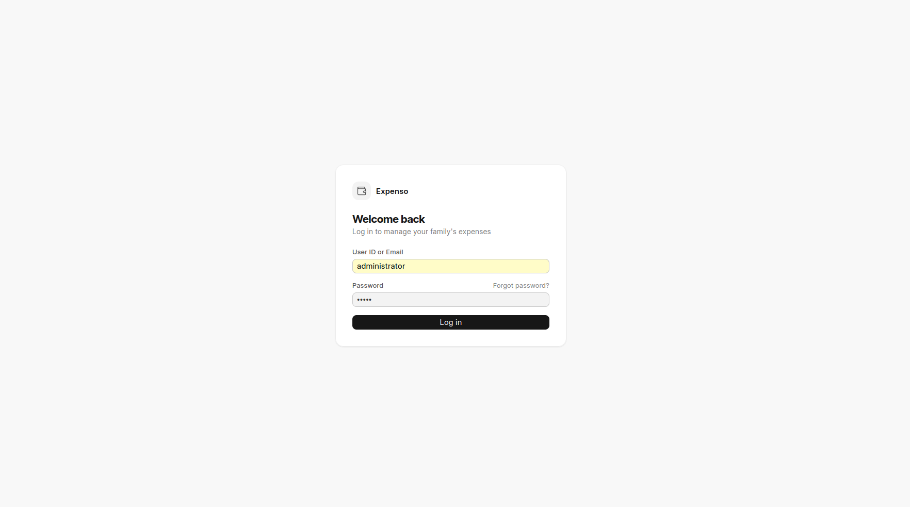
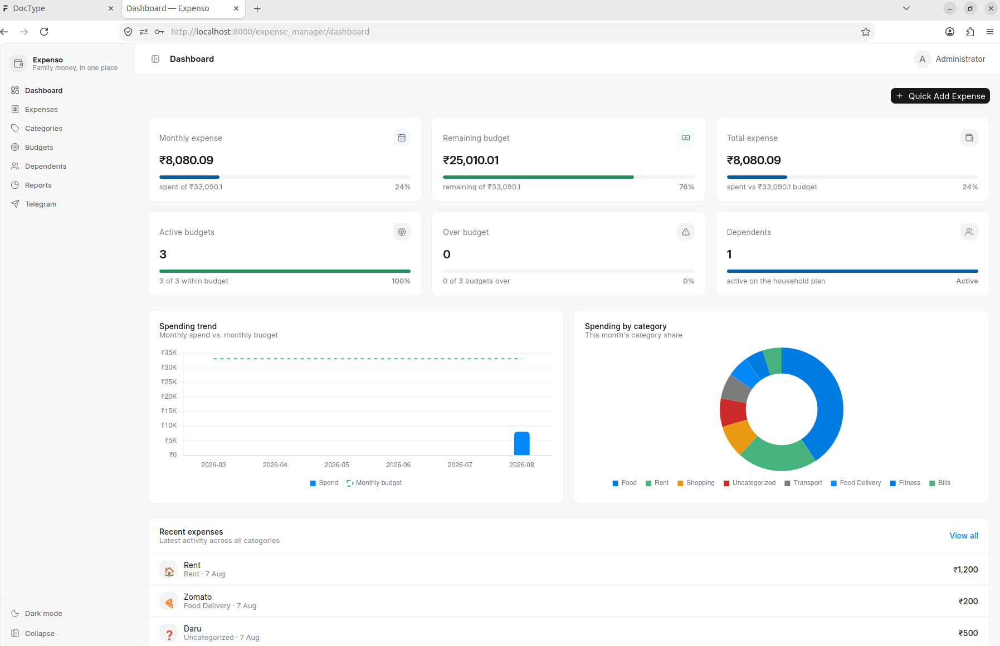
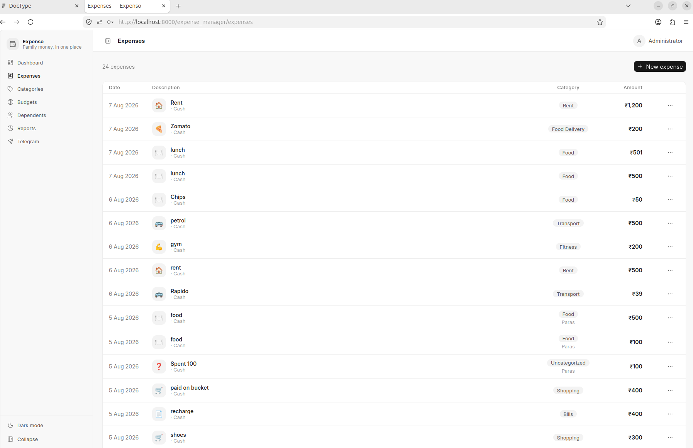
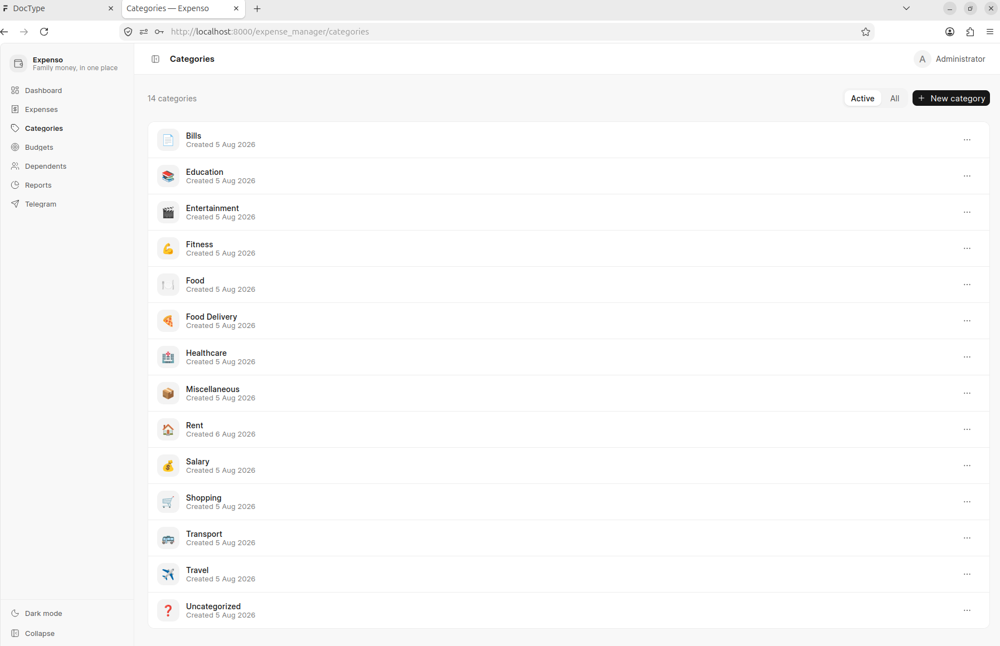
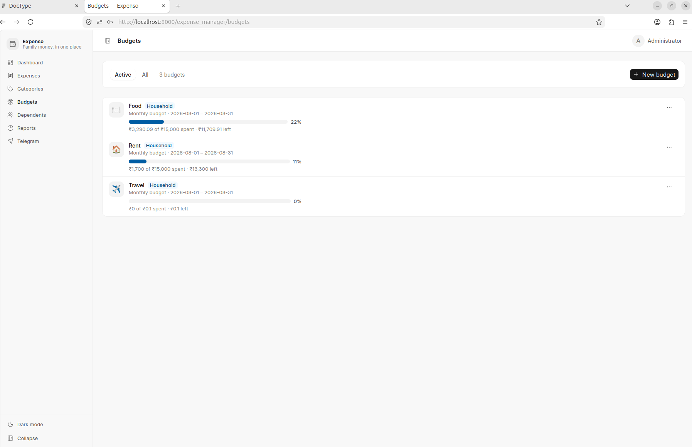
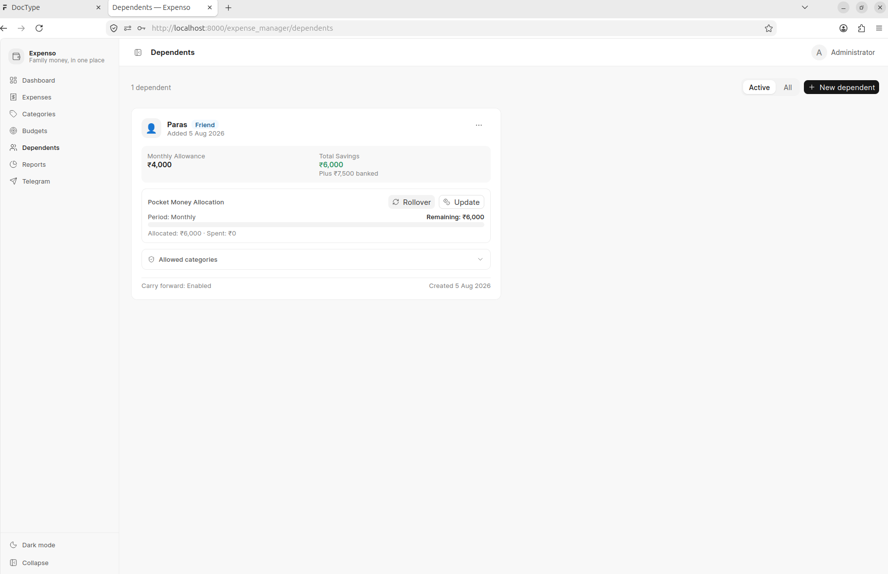
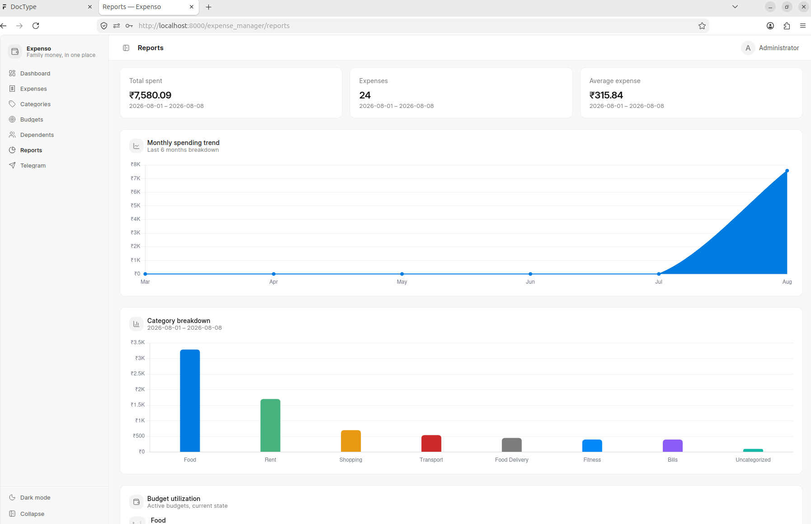
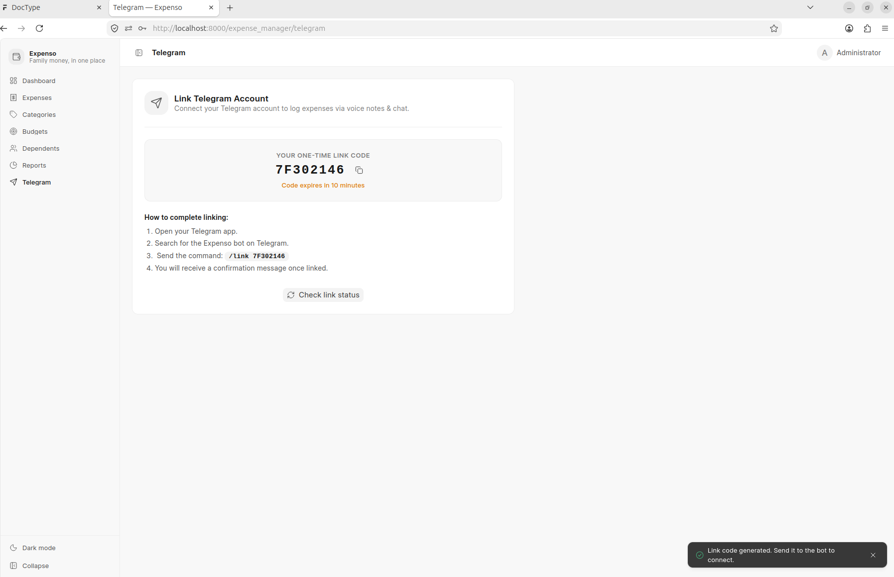

# Expenso — Family Expense Manager

Expenso is a Telegram-bot-driven family expense management system built on the Frappe framework, featuring a Vue 3 (frappe-ui) web application for guardians and an AI-powered conversational Telegram interface for dependents and family members.

Guardians use the web application to oversee household finances, define category budgets, allocate monthly pocket money to dependents with automatic rollover rules, and track spending trends. Dependents and family members log expenses effortlessly in real time via Telegram using plain natural language text or voice notes.

---

## 1. Project Overview

- **Audience**: Guardians managing household finances alongside children or dependent family members who need an accessible, low-friction way to record daily expenses and track pocket money balances.
- **Tech Stack**:
  - **Backend**: [Frappe Framework v16](https://frappeframework.com/) (Python 3.11+, MariaDB, Redis, Bench)
  - **Frontend**: [Vue 3](https://vuejs.org/) + [frappe-ui](https://github.com/frappe/frappe-ui) SPA (Tailwind CSS, Chart.js, Lucide Icons)
  - **Bot Interface**: Telegram Bot API via guest-whitelisted webhook handler
  - **AI Layer**: [Sarvam AI](https://www.sarvam.ai/) Speech-to-Text for voice transcription + [Groq LLM](https://groq.com/) for natural language expense parsing
  - **Tunneling**: Cloudflare Quick Tunnels (`cloudflared`) for local webhook ingress during development

---

## 2. Key Features

### Guardian Web App
- **Financial Dashboard**: Summary metrics (total spend, average transaction amount, expense count), recent expense stream, active budget progress, and overspend warnings.
- **Expense Tracking & Ledger**: Searchable expense stream with category icons, dependent attribution, amount formatting, and action menus for editing or deleting entries, plus quick AI natural language expense input.
- **Budgets & Thresholds**: Monthly category-specific budgets with visual progress indicators, percentage utilization, and automated overspend detection.
- **Category Management**: Custom expense categories with icon selection, active/archived status management, and one-click default category seeding.
- **Dependents & Pocket Money**: Dependent profile management, monthly pocket money allocations, carry-forward rollover controls, allowed category restrictions, and cumulative savings tracking.
- **Visual Reports & Analytics**: 6-month aggregate monthly spending trend (Chart.js line chart), period category breakdown (bar chart), and budget utilization progress.
- **Telegram Linking Dashboard**: Direct account verification interface generating one-time 6-digit linking tokens and managing active bot connections.
- **Responsive App Shell**: Collapsible sidebar, dark/light theme toggle, and session management.

### Telegram Bot (Dependent & Family Facing)
- **Natural Language Text Logging**: Log expenses directly in chat (e.g. `Spent 250 on groceries yesterday` or `/addexpense 150 snacks`).
- **Voice Note Expense Logging**: Send voice messages transcribed and parsed into structured expenses (amount, category, description, date).
- **Account Linking & Security**: One-time 6-digit token verification (`/link <code>`) linking Telegram user IDs to Frappe guardian or dependent records.
- **Pocket Money & Savings**: Real-time balance queries (`/balance`), pocket money allocation status (`/pocketmoney`), cumulative savings tracking (`/savings`), and manual or automated monthly rollover (`/rollover`).
- **Budget Status & Visual Reports**: On-demand category budget checks (`/budgets`) and category breakdown charts sent directly as photos (`/report`).
- **Automated Alerts & Reminders**: Daily nudges for unrecorded expenses, weekly/monthly spending summaries, and proactive budget threshold warnings.

---

## 3. Architecture

Expenso follows a decoupled, service-oriented architecture:

```
                      +-----------------------------+
                      |   Telegram Bot / User Chat  |
                      +--------------+--------------+
                                     | (Webhook POST)
                                     v
                      +-----------------------------+
                      | Cloudflare Tunnel / Ingress |
                      +--------------+--------------+
                                     |
                                     v
+------------------+  REST API       +-----------------------------+
|  Guardian Web    +---------------->+  Frappe Backend (Python)    |
|  (Vue 3 / SPA)   | (CSRF Session)  |  - api/                     |
+------------------+                 |  - services/ (Domain Logic) |
                                     |  - telegram/ (Router & Bot) |
                                     +--------------+--------------+
                                                    |
                         +--------------------------+--------------------------+
                         |                                                     |
                         v                                                     v
          +-----------------------------+                       +-----------------------------+
          |     Frappe ORM & DB         |                       |     External AI Services    |
          |  - Expense                  |                       |  - Sarvam AI (Speech-to-Text|
          |  - Budget                   |                       |  - Groq LLM (Expense Parser)|
          |  - Dependent                |                       +-----------------------------+
          |  - Pocket Money Allocation  |
          |  - Category                 |
          |  - Telegram Link            |
          +-----------------------------+
```

- **Telegram Flow**: Incoming webhook updates hit `/api/method/expense_manager.telegram.webhook.handle`, where secret tokens are verified. The Telegram router delegates messages to command, text, or voice handlers, which invoke domain services (`expense_service`, `budget_service`, `pocket_money_service`) to read/write Frappe DocTypes.
- **Guardian Flow**: The Vue 3 SPA interacts with Frappe through whitelisted REST endpoints under `expense_manager.api.*`, authenticated via Frappe session cookies and CSRF tokens.
- **AI Expense Parsing Flow**: Voice notes received by the bot are downloaded and dispatched to Sarvam AI's speech-to-text API. The transcribed text (or direct text message) is passed to a Groq LLM adapter with the user's available categories. The LLM extracts the amount, matches the category, parses relative dates, and rejects non-expense transactions (e.g. refunds or income) before writing to the database.

---

## 4. Setup & Running Locally

### Prerequisites
- A working Frappe bench environment (Bench CLI, Python 3.11+, MariaDB, Redis, Node.js, Yarn).

### 1. Site Configuration
Expenso uses two sites in development:
- `expense.local`: The primary development site (configured as `default_site` in `common_site_config.json`).
- `expense-test.localhost`: The isolated automated test site.

### 2. Install App to Site
```bash
# From your bench directory:
bench --site expense.local install-app expense_manager
bench --site expense.local migrate
```

### 3. Run Backend Tests
Run the comprehensive test suite against the test site:
```bash
bench --site expense-test.localhost run-tests --app expense_manager
```

### 4. Run Frontend Development Server
The frontend is built with Vite and `frappe-ui`:
```bash
cd apps/expense_manager/frontend
yarn install
yarn dev
```
To build production frontend assets:
```bash
yarn build
```

### 5. Start Telegram Tunnel
Expenso includes a helper script to launch a Cloudflare Quick Tunnel and automatically register the webhook URL with Telegram:

1. Copy the environment template:
   ```bash
   cp scripts/.env.example scripts/.env
   ```
2. Populate `scripts/.env` with your credentials:
   - `TELEGRAM_BOT_TOKEN`: Token obtained from `@BotFather`.
   - `TELEGRAM_WEBHOOK_SECRET`: The secret string matching `telegram_webhook_secret` in your `site_config.json`.
3. Launch the tunnel:
   ```bash
   bash scripts/telegram-tunnel.sh
   ```

---

## 5. Demo Video

[Watch the walkthrough here](VIDEO_URL_PLACEHOLDER)

---

## 6. Screenshots

### Login


### Dashboard


### Expenses


### Categories


### Budgets


### Dependents


### Reports


### Telegram Integration


---

## 7. Known Limitations & Deferred Work

- **Dependent Web Portal**: Dependents currently interact exclusively through the Telegram bot interface. A dedicated, restricted dependent web portal view is deferred.
- **Ephemeral Tunnels in Development**: The automated tunnel helper uses Cloudflare Quick Tunnels (`trycloudflare.com`), which assign ephemeral URLs on restart. Production deployment requires a static domain or named tunnel.
- **Desk Access Model**: Standard Frappe Desk DocType views are restricted to the `System Manager` role; guardian interaction is designed around the custom Vue SPA frontend.
